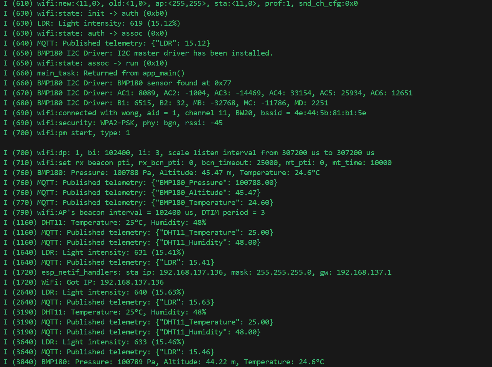
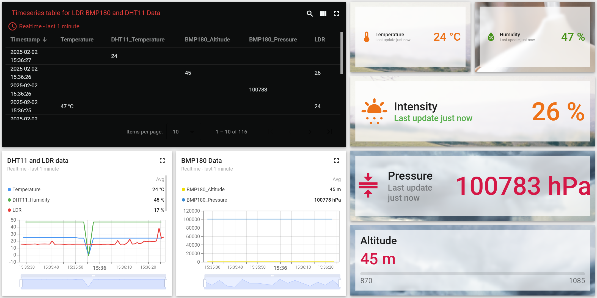

# _ESP32 Sensor Data Collection with FreeRTOS and MQTT_
FreeRTOS is an efficient, real-time operating system designed for embedded systems and microcontrollers. It is widely used in time-sensitive applications such as robotics, IoT devices, and various electronics. FreeRTOS helps manage tasks that need to execute within strict time limits, ensuring responsiveness and reliability.

For ESP32 chips, FreeRTOS is integrated into the ESP-IDF framework, enabling task management, process switching, and device interaction. It allows multiple tasks to run simultaneously while prioritizing them based on urgency, making it ideal for applications involving sensor data handling, communication, and other time-critical operations.

## Circuit Installation 

In this project, we use three sensors:

DHT11: A digital temperature and humidity sensor.
LDR: An analog light-dependent resistor sensor.
BMP180: An I2C communication pressure, altitude, and temperature sensor.

Each sensor is managed by a separate task that runs at different intervals, ensuring efficient handling of sensor data.
## Result from terminal

After flashing the code, here's the result:

_Dashboard_

According to the result above:
- All of the tasks work so well, it successfully read data.
- ESP32S3 be able to connect with WIFI.
- Successfully publish all the data to ThingsBoard

## Conclusion

This project demonstrates the power of FreeRTOS in managing real-time sensor data collection tasks on the ESP32. By assigning different sensor tasks to different rates, the system efficiently handles multiple sensor types, ensuring timely and accurate data transmission to a ThingsBoard server over MQTT.